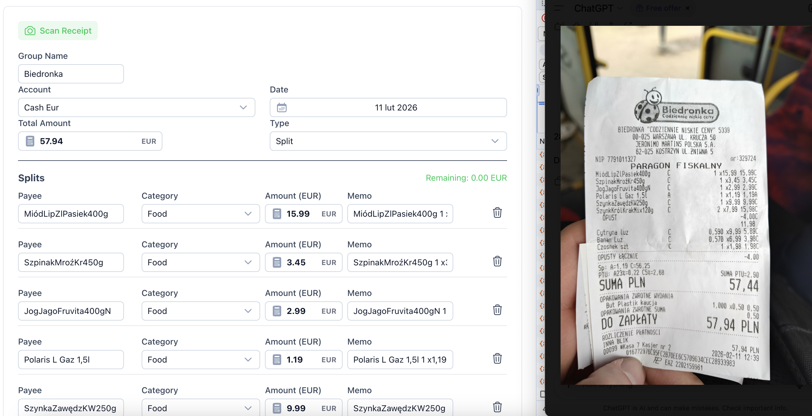
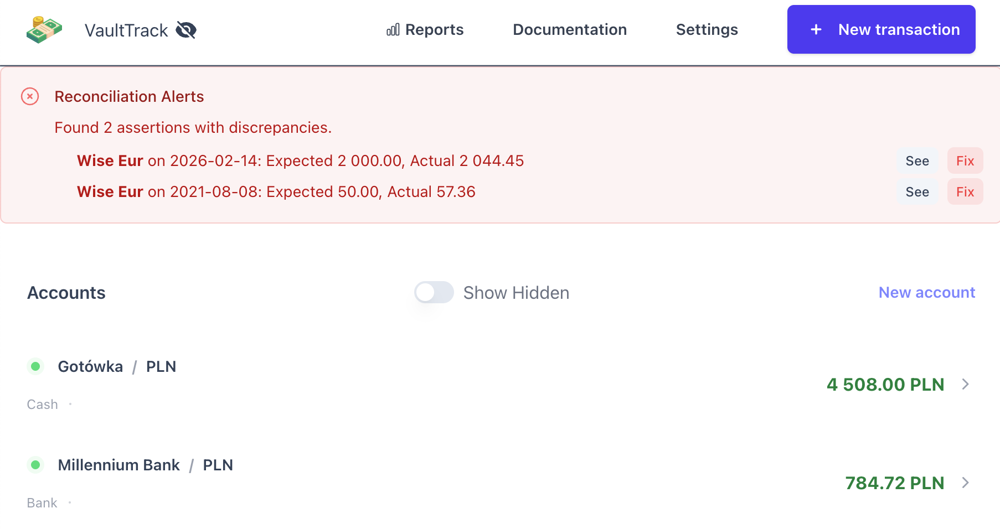
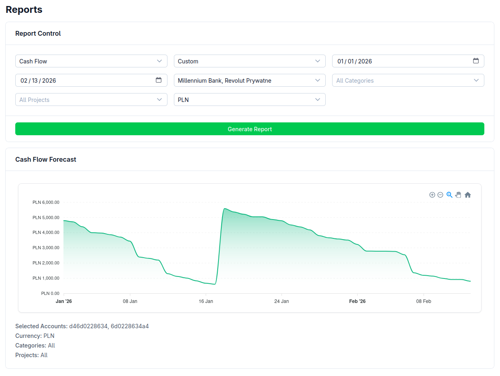

# VaultTrack

**Open Source Expense Management Application**

[](https://vaulttrack.org)

[](LICENSE)

VaultTrack is a modern, privacy-focused, offline-first personal finance application inspired by tools like YNAB and GNUCash. It helps you track accounts, transactions, and budgets with a seamless multi-device experience.

<p align="center">
  
  
  
</p>

**[Live Demo](https://vaulttrack.org)** | **[Documentation](https://docs.vaulttrack.org)**

---

## 🚀 Key Features

*   **Artificial Intelligence**:
    *   **Receipt Scanning**: Instantly extract data from receipts using Google Gemini AI.
    *   **Smart Categorization**: Automatically suggests categories based on payee and items.
*   **Offline-First & Real-Time Sync**: 
    *   Works completely offline using `IndexedDB`.
    *   Synchronizes data between devices in near real-time.
    *   Conflict-free data merging using CRDT-inspired Event Sourcing.
*   **Multi-Device**: Seamlessly switch between desktop and mobile.
*   **Privacy Focused**: Your data belongs to you. No third-party tracking.
*   **Comprehensive Tracking**:
    *   Manage multiple accounts (Cash, Bank, Investment, etc.).
    *   Track income, expenses, and transfers.
    *   **Split Transactions**: Divide a single transaction into multiple categories.
    *   Multi-currency support with automatic exchange rate handling.
    *   Categories and Projects organization.
*   **Balance Assertions**:
    *   Set verification checkpoints (Asserts) for your account balances at specific dates.
    *   **Proactive Integrity**: Verify that your recorded balance matches your actual bank statement.
    *   **Visual Diff**: Instantly see discrepancies (Red/Green indicators) in the transaction list.
    *   **Reconciliation Widget**: Dashboard widget to identify and fix all broken assertions across all accounts in one click.
*   **Advanced Reporting & Visualization**:
    *   **Interactive Charts**: Analyze monthly spending, cash flow forecasts, and category breakdowns.
    *   **Cash Flow Forecasting**: Project future balances based on recurring trends.
    *   **Currency Exchange Rates**: 
        *   Backend-synchronized daily exchange rates (Fiat & Crypto).
        *   View reports in any currency (USD, EUR, PLN, BTC, DOGE, etc.) with real-time conversion.
*   **Import/Export**:
    *   Full QIF (Quicken Interchange Format) import support.
    *   JSON backup and restore.

## 🛠 Tech Stack

*   **Frontend**: [Nuxt 3](https://nuxt.com) (Vue 3) + [Nuxt UI](https://ui.nuxt.com)
*   **Backend**: [Fastify](https://fastify.io/) (Node.js)
*   **Database**: 
    *   **Local**: `IndexedDB` (via `idb`)
    *   **Cloud**: [Turso](https://turso.tech) (LibSQL)
*   **AI Engine**: [Google Gemini](https://deepmind.google/technologies/gemini/) (Generative AI)
*   **State Management**: [Pinia](https://pinia.vuejs.org)
*   **Sync Engine**: Custom Event Sourcing with Long Polling.
*   **Self-Hosting**: You can host your own backend for maximum privacy! See the [Self-Hosting Guide](https://docs.vaulttrack.org/developer-guide/self-hosting).
*   **Testing**: Vitest

## 📦 Getting Started

### Prerequisites

*   Node.js (v24+)
*   pnpm (v9+)

### Installation

1.  **Clone the repository:**
    ```bash
    git clone https://github.com/gustawdaniel/vault-track.git
    cd vault-track
    ```

2.  **Install dependencies:**
    ```bash
    pnpm install
    ```

3.  **Start the development server:**
    ```bash
    pnpm dev --filter ui
    ```
    The app will be available at `http://localhost:3000`.

### Building for Production

```bash
pnpm build
```

## 🏗 Architecture

### Offline Sync Engine

VaultTrack uses a unique **Event Sourcing** approach for synchronization, designed to be robust and conflict-free without requiring complex server-side databases (can run on serverless edge functions):

1.  **Local First**: All actions (creating a transaction, updating an account) are strictly local first. They generate an "Event" (e.g., `TRANSACTION_ADDED`, `ACCOUNT_UPDATED`).
2.  **Event Log**: These events are stored in `IndexedDB`.
3.  **Synchronization**:
    *   **Push**: The client debounces local changes and pushes new events to the server.
    *   **Pull**: The client uses Long Polling to wait for new events from other devices.
    *   **Merge**: Incoming events are merged into the local event log.
    *   **Replay**: The application state (Balances, Lists) is rebuilt by replaying the event log (Reducer pattern).
4.  **Idempotency**: All writes are idempotent, preventing duplicate data issues even with unstable network connections.

### Directory Structure

*   `apps/ui`: Main Nuxt 3 application.
    *   `components`: Vue components.
    *   `pages`: Application routes.
    *   `store`: Pinia stores (Account, Transaction, etc.).
    *   `sync`: Core synchronization logic (`db.ts`, `client.ts`, `manager.ts`, `reducer.ts`).
    *   `server`: Server-side API routes for sync (`/api/sync/*`).

## 🤝 Contributing

Contributions are welcome! Please feel free to submit a Pull Request.

1.  Fork the project.
2.  Create your feature branch (`git checkout -b feature/AmazingFeature`).
3.  Commit your changes (`git commit -m 'Add some AmazingFeature'`).
4.  Push to the branch (`git push origin feature/AmazingFeature`).
5.  Open a Pull Request.

## 📄 License

Distributed under the MIT License. See [LICENSE](LICENSE) for more information.

---

## 🗺️ Long Term Roadmap

Our development focus is strictly prioritized on the following key pillars:

1.  **Full Feature Parity with CashDroid**
    *   Bring back the complete feature set of the classic 2012 Android application, ensuring robust, proven functionality for personal finance management.
    *   Includes: Recurring transactions, advanced filtering, and specific report types.

2.  **Purchasing Power Analysis Layer (Inflation-Awareness)**
    *   A unique analytical layer that allows users to view their finances in **Real Terms** vs **Nominal Terms**.
    *   Analyze spending power relative to external economic metrics (e.g., Average Wage, Inflation/CPI baskets, Big Mac Index) rather than just raw currency numbers.
    *   "How much of the average national wage did I spend on groceries in 2015 vs today?"
